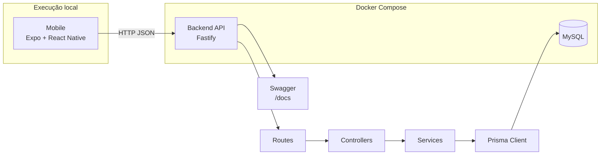

# Process Mapping Case

Monorepo com:
- `backend/` (Fastify + Prisma + MySQL)
- `mobile/` (Expo + React Native)

## Arquitetura (visão gráfica)


## Requisitos
- Docker + Docker Compose
- Node.js 22+
- npm

## Setup recomendado (backend em Docker + mobile local)

1. Suba MySQL + backend:
```bash
docker compose up -d --build
```

2. Configure o mobile:
```bash
cp mobile/.env.example mobile/.env
```

3. Rode o app mobile:
```bash
cd mobile
npm install
npm run start
```

## Setup alternativo (backend local, sem Docker)

1. Suba apenas o MySQL:
```bash
docker compose up -d mysql
```

2. Configure backend:
```bash
cp backend/.env.example backend/.env
```

3. Rode backend local:
```bash
cd backend
npm install
npm run prisma:generate
npm run prisma:push
npm run dev
```

## URLs
- API: `http://localhost:3000`
- Swagger: `http://localhost:3000/docs`
- MySQL: `localhost:3306` (`app` / `app`, db `process_map`)

## Observação de rede (Expo)
- iOS Simulator/Android Emulator: `EXPO_PUBLIC_API_URL=http://localhost:3000`
- Dispositivo físico: use o IP da sua máquina, por exemplo `http://192.168.0.10:3000`
